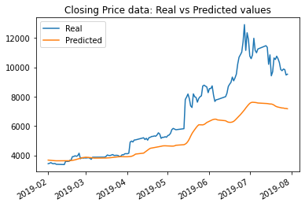
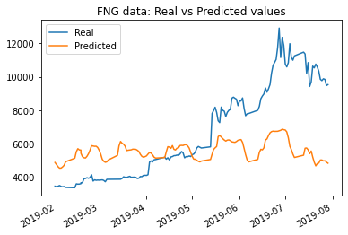
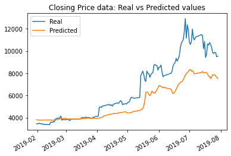
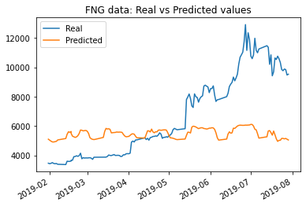

# DeepLrn-Unit-14-hw11
Deep Learning applied to Bitcoin 

Enclosed please find two Jupyter Lab notebooks, each modeling bitcoin closing prices using a type of Recurrent [Neural Networks](https://playground.tensorflow.org/#activation=sigmoid&batchSize=10&dataset=gauss&regDataset=reg-plane&learningRate=0.03&regularizationRate=0&noise=0&networkShape=1&seed=0.13671&showTestData=false&discretize=false&percTrainData=50&x=true&y=true&xTimesY=false&xSquared=true&ySquared=false&cosX=false&sinX=false&cosY=false&sinY=false&collectStats=false&problem=classification&initZero=false&hideText=false) (RNN's) called Long Short-Term Memory Network (LSTM).  This modeling was done with two data inputs: one model used FNG indicators, while the other model was restricted to closing price data alone. 

# Background - FNG Index

FNG (Fear and Greed) indictors relate to the [Crypto Fear and Greed Index (FNG)](https://alternative.me/crypto/fear-and-greed-index/), which was launched by Alternative in January of 2018 ranges from 0 (“Extreme Fear”) to 100 (“Extreme Greed”); and is currently in the 'Fear' zone.

[FNG Index Dial](

The Crypto Fear and Greed Index is based on three factors:

[] Price changes in major cryptocurrencies (bitcoin, ethereum, and ripple). The larger the change in price, the more important that this data becomes;

[] Volume for each of these cryptocurrencies. The greater the volume, the more important that this data becomes;

[] Volatility. This means how much a cryptocurrency fluctuates in price over time.

The fear and greed index was derived from the stock market-based fear and greed index developed by CNNMoney in 2014 related to investors purchases of pubicly-traded stocks. That original index was based on seven factors:

[] Stock Price Momentum - A measure of the Standard & Poor's 500 Index (S&P 500) versus its 125-day moving average (MA).

[] Stock Price Strength - The number of stocks hitting 52-week highs versus those hitting 52-week lows on the New York Stock Exchange (NYSE).

[] Stock Price Breadth - Analyzing the trading volumes in rising stocks against declining stocks.

[] Put and Call Options - The extent to which put options lag behind call options, signifying greed, or surpass them, indicating fear.

[] Junk Bond Demand - Gauging appetite for higher risk strategies by measuring the spread between yields on investment-grade bonds and junk bonds.

[] Market Volatility - CNN measures the Chicago Board Options Exchange Volatility Index (VIX) concentrating on a 50-day MA.

[] Safe Haven Demand - The difference in returns for stocks versus treasuries.

Behavioral economists find a strong correlation between emotion and behavior, and also between the FNG index and stock prices. Two points in time in particular are of note: the stock-related FNG index sank to a low of 12 on Sept. 17, 2008 after [Lehman Brothers declared bankruptcy](https://www.investopedia.com/articles/economics/09/lehman-brothers-collapse.asp) and AIG nearly closed as well. At the opposite end of the spectrum, the stock-related FNG traded over 90 in September 2012 in response to a positive global reaction to the US Federal Reserves policies. 

The underlying concern of the fear and greed indexes are volatility, which is measured (as volatility and investor reaction to volatility) by the CBOE Volatility index, established by the Chicago Board Options Exchange in 1993 - also referred to as the VIX. The VIX calculation process has subsequently been refined over time. It ranges from 0 to 40.. anything over 30 indicates extreme fearfulness on the part of investors to the level of volatility. A vix score below 20 indicates a comfort level with market conditions.  

# Data Inputs

Inputs included FNG index results and bitcoin closing prices from January 2018 to July 2019. The data was changed using a rolling window of number of days, that is a parameter that was modified for best results. The training portion was set to 70%, leaving 30% of the data for testing. 

# Data Preprocessing

The data was normalized (or scaled) using a MinMaxScaler object so that the values were compressed into a range of 0 to 1, in order to best fit the model.  The data features were reshaped into an using numpy.reshape in order to fit the model. 

# Building the Model

The Long Short-Term Memory Network (LSTM) Recurrent Neural Networks (RNN) used was sequential, with a time window of 5, a dropout fraction of .2, and 3 layers. The model was trained using 10 epochs. 

# Training the Model

During training, shuffle was set to 'off', which allows the LSTM model to build its awareness of the data from internal state to internal state during the training process. In order for each LSTM lawyer in the stack to keep info in place,  the 'return_sequence' parameter is set to 'True' for all but the final layer.

# Results

Predictions were made using that model, and then the data was transformed back into it's original date-based framework. It was then matched with actual data within that test data from (February 2019 - August 2019). 

## Results - original parameters

The results with original parameters using closing price data was a loss of: 0.0372; while the results using FNG data was a loss of: 0.0685. 

## Results - Window parameter updated from 10 to 5 days

The results with an updated parameter of the rolling window size being 5 days instead of 10 yielded more accurate results for the closing price-based model, but worse results with the FNG-based model. 

The results with window size changed from 10 to 5 using closing price data saw a change in loss value from: 0.0372 to .0178; while the results using FNG data was a change in loss value from: 0.0685 to .0462. However from the graph the match looks much less accurate. 

## Results - Number of layers increased from 3 to 4 (and Window parameter still at 5 days)

The results with an increased number of layers from 3 to 4 (with the rolling window size held to 5 days still) had the effect of sligthly worsened results in both cases. 

The results with the number of layers increased to 4 using closing price data saw a change in loss value from: .0178 to .019; while the results using FNG data was a change in loss value from: .0462 to .05. 

# Ideas for Future Improvements

One idea to improve results would be to incude more recent data.. the FNG index goes back to January of 2018 (and that data was all provided), and then our dataset ended in July 2019. So additional data on historical prices from August 2019 to the present could be added to the analysis. 

Another idea for improving results would be to use Crypto FNG data elements, and/or go back farther into historical data. I could derive or regain the base data that the FNG was calculated on, and using those 3 data sets, see if those (all 3 together, or price plus volatility, or price plus volume) would have more predictive effectiveness than the FNG itself in relation to price alone. Those 3 components are available in relation to periods priod to when the Crypto FNG index was launched, so the data analysis could start with those earlier periods in that case also.

A third idea would be to translate some of the elements of the original FNG index - related to stocks - to cryptocurrencies-based information. This could perhaps include:

[] Crypto Price Momentum - A measure of the major cryptocurrencies (bitcoin, ethereum, and ripple) versus their 125-day moving average (MA).

[] Crypto Price Strength - The number of cryptocurrencies hitting 52-week highs versus those hitting 52-week lows.

[] Crypto Price Breadth - Analyzing the volumes in rising vs. declining cryptocurrencies.

[] Risk Appetite - Gauging appetite for higher risk strategies by measuring the spread between yields on various cryptocurrencies, or between cryptocurrencies and NFT's perhaps.

# Other aspects

A random number seed was included to ensure that the results were reproducible.

These notebooks also contain a time tracking feature to indicate length of runtime.

# Technical Notes

Libraries

-- numpy

-- pandas

--hvplot

--tensorflow

--sklearn

--time

# Acknowledgements

I would like to first acknowledge the guidance and teaching of our FinTech Boot Camp Instructor, Garth Mortensen, our Student Success Manager, Angelica Baraona; and the whole team behind the curriculum, the logistics, the whole program. I also found the collective Stack Overflow wisdom essential as ever. A primary source for this unit overall is of course [Jason Brownlee's 'Maching Learning Mastery' series, especially the entry entitled: 'Time Series Prediction with LSTM Recurrent Neural Networks in Python with Keras'](https://machinelearningmastery.com/time-series-prediction-lstm-recurrent-neural-networks-python-keras/), another was the [TensorFlow documentation](https://www.tensorflow.org/api_docs/python/tf/estimator/Estimator). In looking further at the Fear and Greed index, I found these articles helpful: [Crypto Fear and Greed Index Explained - India CSR](https://indiacsr.in/crypto-fear-and-greed-index-explained/) and [Crypto 'Fear & Greed' Index Is Latest Talisman for Bitcoin Fans- Crypto fans are turning to an old Wall Street idea as the latest way to justify buying the dip after the recent slump.](https://www.bloomberg.com/news/articles/2021-12-07/crypto-fear-greed-index-is-latest-talisman-for-bitcoin-fans), and [Investopedia](https://www.investopedia.com/terms/f/fear-and-greed-index.asp).  Some other resources that have enriched by ML journey include 'unBusiness Intelligence' by Dr. Barry Devlin, on the origins of big data,  'Advancing into Analytics' by George Mount was helpful review again of the broader analytics landscape. For machine learning itself from another perspective, I liked 'Python Data Science Handbook' by Jake VanderPlas. My other main resource specifically on this projects' coding was 'Hands-On Machine Learning with Scikit-Learn, Keras & TensorFlow' by Aurelien Geron. 

